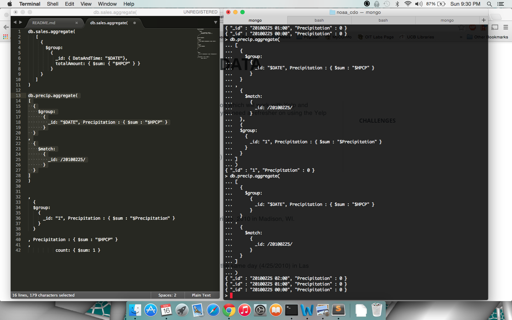

# Challenge Week 12 Submission Template

# Reddit Data Challenges

## Challenge 1

## Challenge 2

When interating through to see all of the subreddits on reddit, there are tons of subreddits, which many seem to be only applicable for small groups that are using them.

## Challenge 3

From this massive list of comments, you can begin to figure out what the interests are of certain people. By looking at all of a persons comments and sorting by subreddits, you can reasonably know what a person may be passionate about.

## Challenge 4

We could see whether or not the reddit community is mostly a small amount of really involved individuals or whether or not the comment spread is fairly consistent from user to user.

## Challenge 5

[Link to Code or pasted code]
[Answer]

## Challenge 6

If only highly ranked comments were in the above query, it would definitely skew the number of people who are active in a subreddit. Also, some people who are expert "reditters", who comment often and attract many upvotes would dominate the list of people who are active in a subreddit.

## Challenge 7

I would conclude that there is a relatively small number of people who provide much of the upvoted content on Reddit, and if looking between multiple subreddits the number of overlap of users who are upvoted often might be smaller.

## Challenge 8

[Bias in answer]

## Challenge 9

[Other Biases]

## Challenge 10

[How may you try and prove the bias]

# Yelp and Weather 

## Challenge 1

0 in of rain on March 3, 2010

## Challenge 2

## Challenge 3, 4, and 5

Madison:1630
Las Vegas:12022
Phoenix: 7499

